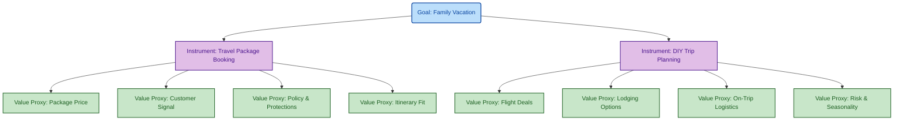
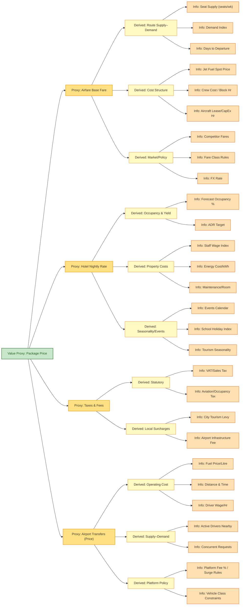
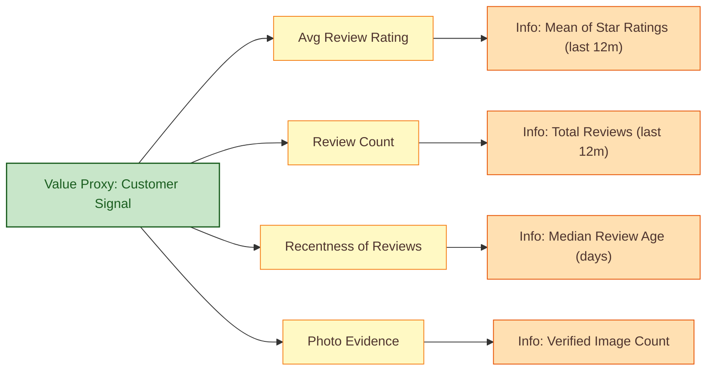
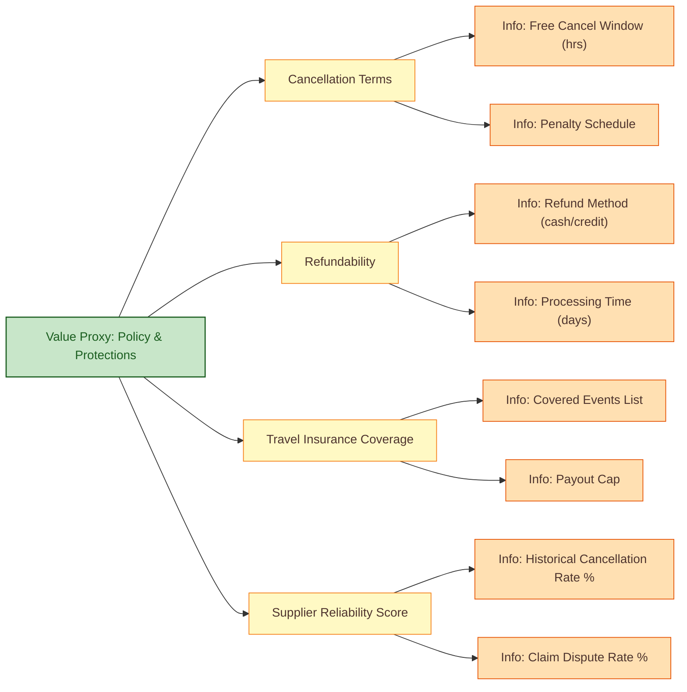
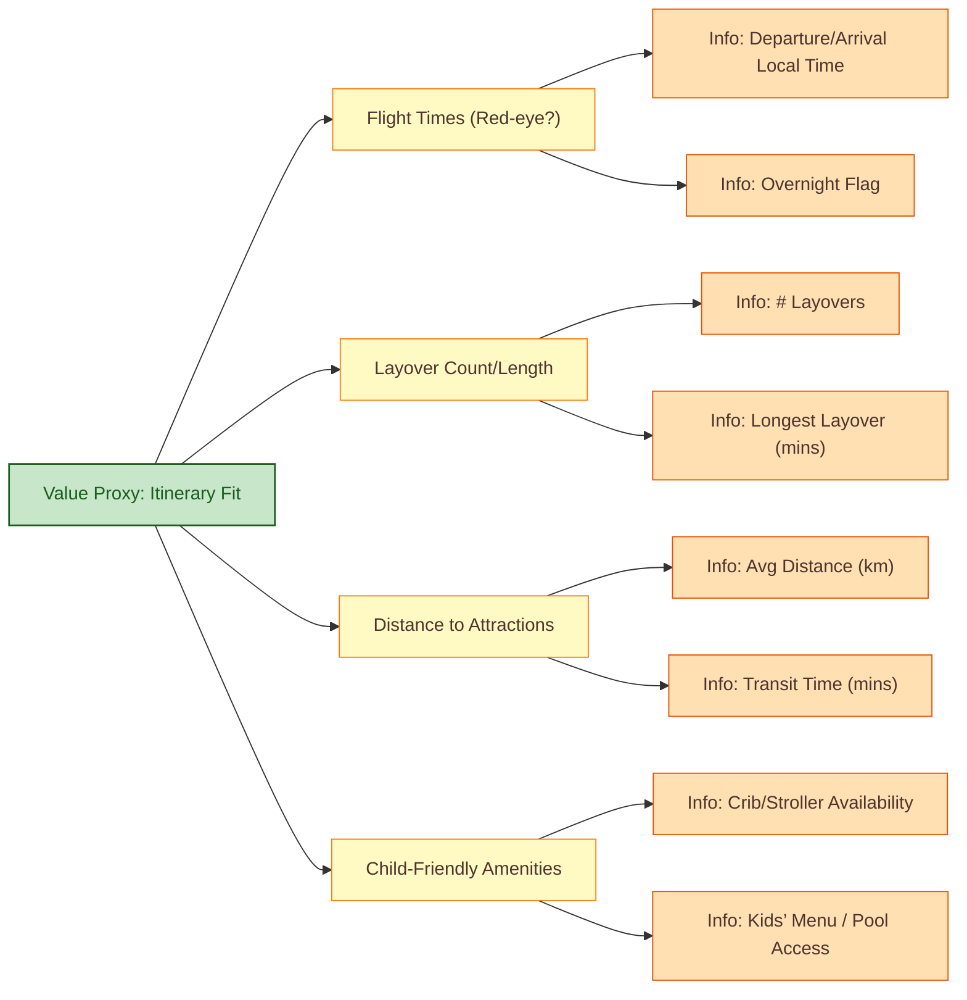
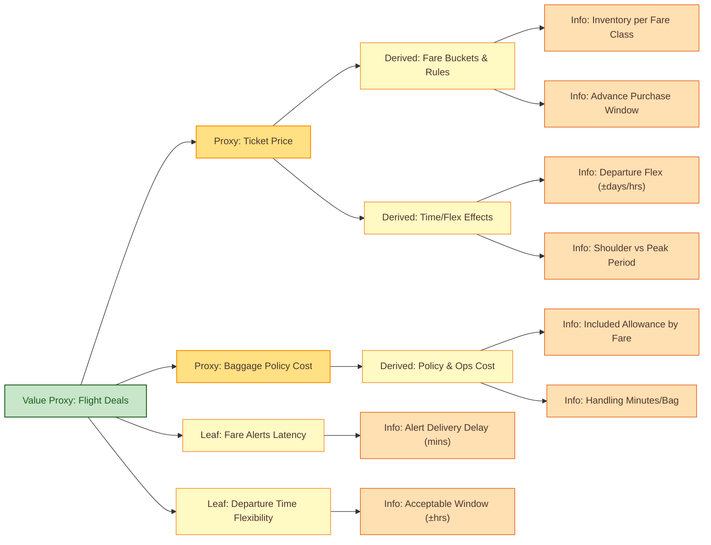
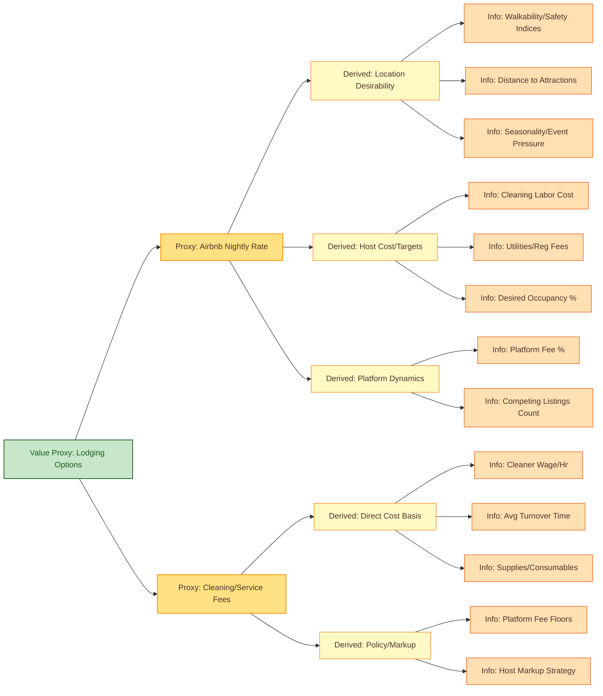
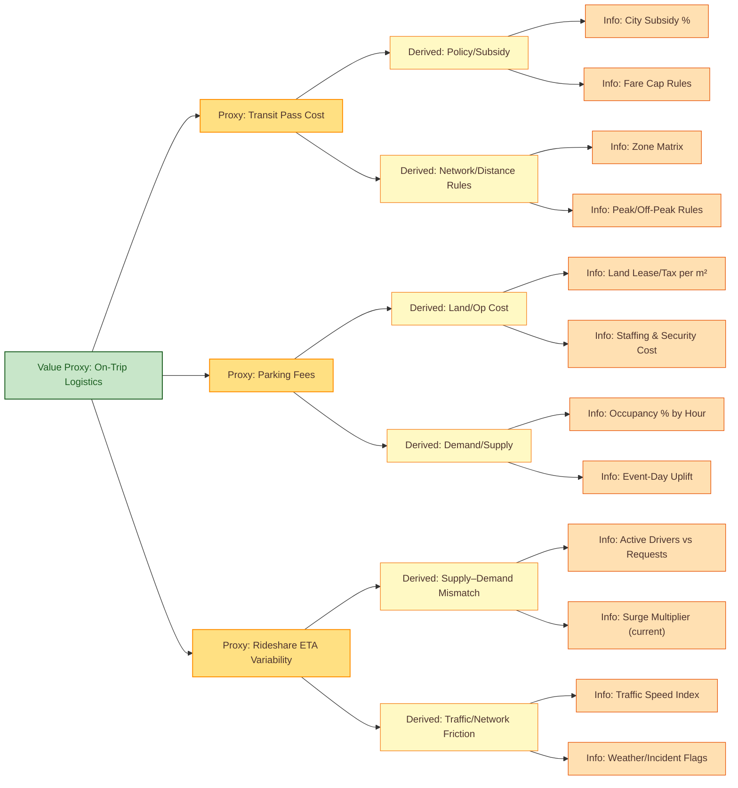
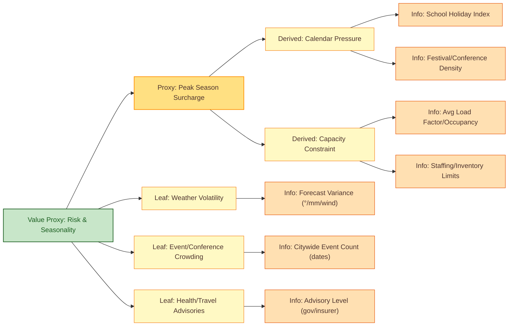

```mermaid
graph TB
%% Reusable class definitions
classDef goal fill:#BBDEFB,stroke:#0D47A1,stroke-width:2px,color:#0D47A1;
classDef instrument fill:#E1BEE7,stroke:#4A148C,stroke-width:1.5px,color:#4A148C;
classDef proxy fill:#C8E6C9,stroke:#1B5E20,stroke-width:1.5px,color:#1B5E20;
classDef pricelike fill:#FFE082,stroke:#FF8F00,stroke-width:1.5px,color:#4E342E;
classDef derived fill:#FFF9C4,stroke:#F57F17,stroke-width:1px,color:#4E342E;
classDef info fill:#FFE0B2,stroke:#E65100,stroke-width:1px,color:#4E342E;
  %% include classDef block above this chart

  A(Goal: Family Vacation)
  A --> B1[Instrument: Travel Package Booking]
  A --> B2[Instrument: DIY Trip Planning]

  B1 --> C1[Value Proxy: Package Price]
  B1 --> C2[Value Proxy: Customer Signal]
  B1 --> C3[Value Proxy: Policy & Protections]
  B1 --> C4[Value Proxy: Itinerary Fit]

  B2 --> C5[Value Proxy: Flight Deals]
  B2 --> C6[Value Proxy: Lodging Options]
  B2 --> C7[Value Proxy: On-Trip Logistics]
  B2 --> C8[Value Proxy: Risk & Seasonality]

  class A goal
  class B1,B2 instrument
  class C1,C2,C3,C4,C5,C6,C7,C8 proxy
```

```mermaid
graph LR
%% Reusable class definitions
classDef goal fill:#BBDEFB,stroke:#0D47A1,stroke-width:2px,color:#0D47A1;
classDef instrument fill:#E1BEE7,stroke:#4A148C,stroke-width:1.5px,color:#4A148C;
classDef proxy fill:#C8E6C9,stroke:#1B5E20,stroke-width:1.5px,color:#1B5E20;
classDef pricelike fill:#FFE082,stroke:#FF8F00,stroke-width:1.5px,color:#4E342E;
classDef derived fill:#FFF9C4,stroke:#F57F17,stroke-width:1px,color:#4E342E;
classDef info fill:#FFE0B2,stroke:#E65100,stroke-width:1px,color:#4E342E;
  %% include classDef block above this chart

  C1[Value Proxy: Package Price] --> P1[Proxy: Airfare Base Fare]
  C1 --> P2[Proxy: Hotel Nightly Rate]
  C1 --> P3[Proxy: Taxes & Fees]
  C1 --> P4["Proxy: Airport Transfers (Price)"]

  %% Airfare
  P1 --> D11[Derived: Route Supply–Demand]
  D11 --> I111["Info: Seat Supply (seats/wk)"]
  D11 --> I112["Info: Demand Index"]
  D11 --> I113["Info: Days to Departure"]
  P1 --> D12[Derived: Cost Structure]
  D12 --> I121[Info: Jet Fuel Spot Price]
  D12 --> I122[Info: Crew Cost / Block Hr]
  D12 --> I123[Info: Aircraft Lease/CapEx Hr]
  P1 --> D13[Derived: Market/Policy]
  D13 --> I131[Info: Competitor Fares]
  D13 --> I132[Info: Fare Class Rules]
  D13 --> I133[Info: FX Rate]

  %% Hotel
  P2 --> D21[Derived: Occupancy & Yield]
  D21 --> I211[Info: Forecast Occupancy %]
  D21 --> I212[Info: ADR Target]
  P2 --> D22[Derived: Property Costs]
  D22 --> I221[Info: Staff Wage Index]
  D22 --> I222[Info: Energy Cost/kWh]
  D22 --> I223[Info: Maintenance/Room]
  P2 --> D23[Derived: Seasonality/Events]
  D23 --> I231[Info: Events Calendar]
  D23 --> I232[Info: School Holiday Index]
  D23 --> I233[Info: Tourism Seasonality]

  %% Taxes & Fees
  P3 --> D31[Derived: Statutory]
  D31 --> I311[Info: VAT/Sales Tax]
  D31 --> I312[Info: Aviation/Occupancy Tax]
  P3 --> D32[Derived: Local Surcharges]
  D32 --> I321[Info: City Tourism Levy]
  D32 --> I322[Info: Airport Infrastructure Fee]

  %% Transfers
  P4 --> D41[Derived: Operating Cost]
  D41 --> I411[Info: Fuel Price/Litre]
  D41 --> I412[Info: Distance & Time]
  D41 --> I413[Info: Driver Wage/Hr]
  P4 --> D42[Derived: Supply–Demand]
  D42 --> I421[Info: Active Drivers Nearby]
  D42 --> I422[Info: Concurrent Requests]
  P4 --> D43[Derived: Platform Policy]
  D43 --> I431[Info: Platform Fee % / Surge Rules]
  D43 --> I432[Info: Vehicle Class Constraints]

  class C1 proxy
  class P1,P2,P3,P4 pricelike
  class D11,D12,D13,D21,D22,D23,D31,D32,D41,D42,D43 derived
  class I111,I112,I113,I121,I122,I123,I131,I132,I133,I211,I212,I221,I222,I223,I231,I232,I233,I311,I312,I321,I322,I411,I412,I413,I421,I422,I431,I432 info
```

```mermaid
graph LR
%% Reusable class definitions
classDef goal fill:#BBDEFB,stroke:#0D47A1,stroke-width:2px,color:#0D47A1;
classDef instrument fill:#E1BEE7,stroke:#4A148C,stroke-width:1.5px,color:#4A148C;
classDef proxy fill:#C8E6C9,stroke:#1B5E20,stroke-width:1.5px,color:#1B5E20;
classDef pricelike fill:#FFE082,stroke:#FF8F00,stroke-width:1.5px,color:#4E342E;
classDef derived fill:#FFF9C4,stroke:#F57F17,stroke-width:1px,color:#4E342E;
classDef info fill:#FFE0B2,stroke:#E65100,stroke-width:1px,color:#4E342E;
  %% include classDef block above this chart

  C2[Value Proxy: Customer Signal] --> L1[Avg Review Rating]
  C2 --> L2[Review Count]
  C2 --> L3[Recentness of Reviews]
  C2 --> L4[Photo Evidence]

  %% Optional: light derivations (still terminate in info)
  L1 --> I11["Info: Mean of Star Ratings (last 12m)"]
  L2 --> I21["Info: Total Reviews (last 12m)"]
  L3 --> I31["Info: Median Review Age (days)"]
  L4 --> I41["Info: Verified Image Count"]

  class C2 proxy
  class L1,L2,L3,L4 derived
  class I11,I21,I31,I41 info
```

```mermaid
graph LR
%% Reusable class definitions
classDef goal fill:#BBDEFB,stroke:#0D47A1,stroke-width:2px,color:#0D47A1;
classDef instrument fill:#E1BEE7,stroke:#4A148C,stroke-width:1.5px,color:#4A148C;
classDef proxy fill:#C8E6C9,stroke:#1B5E20,stroke-width:1.5px,color:#1B5E20;
classDef pricelike fill:#FFE082,stroke:#FF8F00,stroke-width:1.5px,color:#4E342E;
classDef derived fill:#FFF9C4,stroke:#F57F17,stroke-width:1px,color:#4E342E;
classDef info fill:#FFE0B2,stroke:#E65100,stroke-width:1px,color:#4E342E;
  %% include classDef block above this chart

  C3[Value Proxy: Policy & Protections] --> D1[Cancellation Terms]
  C3 --> D2[Refundability]
  C3 --> D3[Travel Insurance Coverage]
  C3 --> D4[Supplier Reliability Score]

  D1 --> I11["Info: Free Cancel Window (hrs)"]
  D1 --> I12["Info: Penalty Schedule"]
  D2 --> I21["Info: Refund Method (cash/credit)"]
  D2 --> I22["Info: Processing Time (days)"]
  D3 --> I31[Info: Covered Events List]
  D3 --> I32[Info: Payout Cap]
  D4 --> I41[Info: Historical Cancellation Rate %]
  D4 --> I42[Info: Claim Dispute Rate %]

  class C3 proxy
  class D1,D2,D3,D4 derived
  class I11,I12,I21,I22,I31,I32,I41,I42 info
```

```mermaid
graph LR
%% Reusable class definitions
classDef goal fill:#BBDEFB,stroke:#0D47A1,stroke-width:2px,color:#0D47A1;
classDef instrument fill:#E1BEE7,stroke:#4A148C,stroke-width:1.5px,color:#4A148C;
classDef proxy fill:#C8E6C9,stroke:#1B5E20,stroke-width:1.5px,color:#1B5E20;
classDef pricelike fill:#FFE082,stroke:#FF8F00,stroke-width:1.5px,color:#4E342E;
classDef derived fill:#FFF9C4,stroke:#F57F17,stroke-width:1px,color:#4E342E;
classDef info fill:#FFE0B2,stroke:#E65100,stroke-width:1px,color:#4E342E;
  %% include classDef block above this chart

  C4[Value Proxy: Itinerary Fit] --> D1["Flight Times (Red-eye?)"]
  C4 --> D2[Layover Count/Length]
  C4 --> D3[Distance to Attractions]
  C4 --> D4[Child-Friendly Amenities]

  D1 --> I11["Info: Departure/Arrival Local Time"]
  D1 --> I12["Info: Overnight Flag"]
  D2 --> I21["Info: # Layovers"]
  D2 --> I22["Info: Longest Layover (mins)"]
  D3 --> I31["Info: Avg Distance (km)"]
  D3 --> I32["Info: Transit Time (mins)"]
  D4 --> I41["Info: Crib/Stroller Availability"]
  D4 --> I42["Info: Kids’ Menu / Pool Access"]

  class C4 proxy
  class D1,D2,D3,D4 derived
  class I11,I12,I21,I22,I31,I32,I41,I42 info
```

```mermaid
graph LR
%% Reusable class definitions
classDef goal fill:#BBDEFB,stroke:#0D47A1,stroke-width:2px,color:#0D47A1;
classDef instrument fill:#E1BEE7,stroke:#4A148C,stroke-width:1.5px,color:#4A148C;
classDef proxy fill:#C8E6C9,stroke:#1B5E20,stroke-width:1.5px,color:#1B5E20;
classDef pricelike fill:#FFE082,stroke:#FF8F00,stroke-width:1.5px,color:#4E342E;
classDef derived fill:#FFF9C4,stroke:#F57F17,stroke-width:1px,color:#4E342E;
classDef info fill:#FFE0B2,stroke:#E65100,stroke-width:1px,color:#4E342E;
  %% include classDef block above this chart

  C5[Value Proxy: Flight Deals] --> P1[Proxy: Ticket Price]
  C5 --> P2[Proxy: Baggage Policy Cost]
  C5 --> L3[Leaf: Fare Alerts Latency]
  C5 --> L4[Leaf: Departure Time Flexibility]

  P1 --> D11[Derived: Fare Buckets & Rules]
  D11 --> I111[Info: Inventory per Fare Class]
  D11 --> I112[Info: Advance Purchase Window]
  P1 --> D12[Derived: Time/Flex Effects]
  D12 --> I121["Info: Departure Flex (±days/hrs)"]
  D12 --> I122[Info: Shoulder vs Peak Period]

  P2 --> D21[Derived: Policy & Ops Cost]
  D21 --> I211[Info: Included Allowance by Fare]
  D21 --> I212[Info: Handling Minutes/Bag]

  L3 --> I31["Info: Alert Delivery Delay (mins)"]
  L4 --> I41["Info: Acceptable Window (±hrs)"]

  class C5 proxy
  class P1,P2 pricelike
  class D11,D12,D21 derived
  class L3,L4 derived
  class I111,I112,I121,I122,I211,I212,I31,I41 info
```

```mermaid
graph LR
%% Reusable class definitions
classDef goal fill:#BBDEFB,stroke:#0D47A1,stroke-width:2px,color:#0D47A1;
classDef instrument fill:#E1BEE7,stroke:#4A148C,stroke-width:1.5px,color:#4A148C;
classDef proxy fill:#C8E6C9,stroke:#1B5E20,stroke-width:1.5px,color:#1B5E20;
classDef pricelike fill:#FFE082,stroke:#FF8F00,stroke-width:1.5px,color:#4E342E;
classDef derived fill:#FFF9C4,stroke:#F57F17,stroke-width:1px,color:#4E342E;
classDef info fill:#FFE0B2,stroke:#E65100,stroke-width:1px,color:#4E342E;
  %% include classDef block above this chart

  C6[Value Proxy: Lodging Options] --> P1[Proxy: Airbnb Nightly Rate]
  C6 --> P2[Proxy: Cleaning/Service Fees]

  P1 --> D11[Derived: Location Desirability]
  D11 --> I111[Info: Walkability/Safety Indices]
  D11 --> I112[Info: Distance to Attractions]
  D11 --> I113[Info: Seasonality/Event Pressure]
  P1 --> D12[Derived: Host Cost/Targets]
  D12 --> I121[Info: Cleaning Labor Cost]
  D12 --> I122[Info: Utilities/Reg Fees]
  D12 --> I123[Info: Desired Occupancy %]
  P1 --> D13[Derived: Platform Dynamics]
  D13 --> I131[Info: Platform Fee %]
  D13 --> I132[Info: Competing Listings Count]

  P2 --> D21[Derived: Direct Cost Basis]
  D21 --> I211[Info: Cleaner Wage/Hr]
  D21 --> I212[Info: Avg Turnover Time]
  D21 --> I213[Info: Supplies/Consumables]
  P2 --> D22[Derived: Policy/Markup]
  D22 --> I221[Info: Platform Fee Floors]
  D22 --> I222[Info: Host Markup Strategy]

  class C6 proxy
  class P1,P2 pricelike
  class D11,D12,D13,D21,D22 derived
  class I111,I112,I113,I121,I122,I123,I131,I132,I211,I212,I213,I221,I222 info
```

```mermaid
graph LR
%% Reusable class definitions
classDef goal fill:#BBDEFB,stroke:#0D47A1,stroke-width:2px,color:#0D47A1;
classDef instrument fill:#E1BEE7,stroke:#4A148C,stroke-width:1.5px,color:#4A148C;
classDef proxy fill:#C8E6C9,stroke:#1B5E20,stroke-width:1.5px,color:#1B5E20;
classDef pricelike fill:#FFE082,stroke:#FF8F00,stroke-width:1.5px,color:#4E342E;
classDef derived fill:#FFF9C4,stroke:#F57F17,stroke-width:1px,color:#4E342E;
classDef info fill:#FFE0B2,stroke:#E65100,stroke-width:1px,color:#4E342E;
  %% include classDef block above this chart

  C7[Value Proxy: On-Trip Logistics] --> P1[Proxy: Transit Pass Cost]
  C7 --> P2[Proxy: Parking Fees]
  C7 --> P3[Proxy: Rideshare ETA Variability]

  P1 --> D11[Derived: Policy/Subsidy]
  D11 --> I111[Info: City Subsidy %]
  D11 --> I112[Info: Fare Cap Rules]
  P1 --> D12[Derived: Network/Distance Rules]
  D12 --> I121[Info: Zone Matrix]
  D12 --> I122[Info: Peak/Off-Peak Rules]

  P2 --> D21[Derived: Land/Op Cost]
  D21 --> I211[Info: Land Lease/Tax per m²]
  D21 --> I212[Info: Staffing & Security Cost]
  P2 --> D22[Derived: Demand/Supply]
  D22 --> I221[Info: Occupancy % by Hour]
  D22 --> I222[Info: Event-Day Uplift]

  P3 --> D31[Derived: Supply–Demand Mismatch]
  D31 --> I311[Info: Active Drivers vs Requests]
  D31 --> I312["Info: Surge Multiplier (current)"]
  P3 --> D32[Derived: Traffic/Network Friction]
  D32 --> I321[Info: Traffic Speed Index]
  D32 --> I322[Info: Weather/Incident Flags]

  class C7 proxy
  class P1,P2,P3 pricelike
  class D11,D12,D21,D22,D31,D32 derived
  class I111,I112,I121,I122,I211,I212,I221,I222,I311,I312,I321,I322 info
```

```mermaid
graph LR
%% Reusable class definitions
classDef goal fill:#BBDEFB,stroke:#0D47A1,stroke-width:2px,color:#0D47A1;
classDef instrument fill:#E1BEE7,stroke:#4A148C,stroke-width:1.5px,color:#4A148C;
classDef proxy fill:#C8E6C9,stroke:#1B5E20,stroke-width:1.5px,color:#1B5E20;
classDef pricelike fill:#FFE082,stroke:#FF8F00,stroke-width:1.5px,color:#4E342E;
classDef derived fill:#FFF9C4,stroke:#F57F17,stroke-width:1px,color:#4E342E;
classDef info fill:#FFE0B2,stroke:#E65100,stroke-width:1px,color:#4E342E;
  %% include classDef block above this chart

  C8[Value Proxy: Risk & Seasonality] --> P1[Proxy: Peak Season Surcharge]
  C8 --> L2[Leaf: Weather Volatility]
  C8 --> L3[Leaf: Event/Conference Crowding]
  C8 --> L4[Leaf: Health/Travel Advisories]

  P1 --> D11[Derived: Calendar Pressure]
  D11 --> I111[Info: School Holiday Index]
  D11 --> I112[Info: Festival/Conference Density]
  P1 --> D12[Derived: Capacity Constraint]
  D12 --> I121[Info: Avg Load Factor/Occupancy]
  D12 --> I122[Info: Staffing/Inventory Limits]

  L2 --> I21["Info: Forecast Variance (°/mm/wind)"]
  L3 --> I31["Info: Citywide Event Count (dates)"]
  L4 --> I41["Info: Advisory Level (gov/insurer)"]

  class C8 proxy
  class P1 pricelike
  class L2,L3,L4 derived
  class D11,D12 derived
  class I111,I112,I121,I122,I21,I31,I41 info
```
